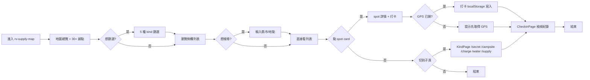

# rv-supply-map · PRD v3.0.2 等級規格書

> 自動生成：2026-09-06
> 對齊 SPEC v3.0 契約（§1–§19 全部套用）
> 升級自既有 `web/README.md` Sprint 1 規劃（2026-08，TypeScript strict + Vite）

---

## 1. 產品概述

### 1.1 問題陳述

露營車 / 自走式車泊族在台灣面臨 3 大痛點：

1. **不知道哪裡能過夜** — Mobile01 車泊分享文零散、沒有結構化座標
2. **不知道哪裡有水 / 電** — 蟬說車泊只有營區資訊，PlugShare 只有充電樁，三個資料源不互通
3. **法規 / 合法性霧煞煞** — 哪些點是合法、哪些是秘境、哪些有風險 — 沒人整理

本專案目標：把 **30+ 個真實車泊據點**（Mobile01 + 蟬說 + PlugShare 整合）變成一個**結構化地圖 + 5 維 kind 分類**（車泊秘境 / 露營區 / 充電站 / 加水站 / 補給站），純前端 + localStorage 為主，搶下「**台灣唯一整合車泊地圖**」這個 sweet spot。

### 1.2 目標使用者

| Persona | 工作情境 | 主要任務 |
|---|---|---|
| **Primary：RV 車泊族** | 週末 / 連假出遊，1-3 天行程 | 找今晚能過夜 + 有水電的點 |
| **Primary：蟬說 / 露營區經營者** | 想曝光自家營區 | 讓車泊族知道有友善營區 |
| **Primary：自走式露營愛好者** | 每月 2-3 次車泊旅行 | 累積打卡地圖 + 分享路線 |
| **Secondary：露營車出租業者** | 客戶諮詢「哪裡能去」 | 提供客戶完整地圖 |
| **Secondary：PlugShare 充電站業者** | 讓露營車主知道站點 | 曝光自家站點 |

### 1.3 核心價值主張

> **「出發前 30 秒知道今晚能去哪、有沒有水電、合法嗎」** — 30+ 真實據點 + 5 維 kind 分類 + GPS 定位 + 打卡，純前端免登入免裝 App。

### 1.4 Non-Goals（明確不做）

- ❌ **不做會員制 / 訂閱 / 付費** — 完全免費、免登入
- ❌ **不做帳號系統** — localStorage 為主
- ❌ **不做雲端同步** — 純前端
- ❌ **不做後端管理後台** — 資料預先整理
- ❌ **不做路線規劃** — 聚焦「找點」不做「規劃路線」
- ❌ **不做評論系統** — 打卡次數已能反映熱度
- ❌ **不做國際語言** — 鎖繁中
- ❌ **不做 Native iOS / Android** — Web 即可（PWA 預留）
- ❌ **不做整合外部 API 即時資料** — Mobile01 / 蟬說 / PlugShare 為預整理 mock，未來可加

---

## 2. 使用者場景與流程

### 2.1 使用者流程圖



### 2.2 主要場景

| 場景 | 輸入 | 輸出 | 成功條件 |
|---|---|---|---|
| **S1：車泊族找今晚點** | 不篩選，看地圖 | 30+ 點全部顯示 | 首屏載入 ≤ 2 秒 |
| **S2：找有水有電的露營區** | kind=campsite + 看 💧⚡ 標籤 | 篩出露營區清單 | 篩選 ≤ 300ms |
| **S3：找合法免費的車泊秘境** | kind=secret + isLegal + isFree | 篩出合法秘境 | 篩選 ≤ 500ms |
| **S4：搜尋特定縣市** | 輸入「台中」| 顯示台中所有點 | 搜尋 ≤ 200ms |
| **S5：點 spot 打卡** | 點 card → 取得 GPS → 打卡 | localStorage 寫入 | 打卡 ≤ 1 秒 |
| **S6：檢視打卡紀錄** | 進入 /checkin | 列出歷史打卡 | localStorage query ≤ 200ms |
| **S7：切深色 / 淺色模式** | 點 ThemeToggle | 主題切換 + 持久化 | localStorage 寫入 |

---

## 3. 功能需求

| FR | 名稱 | 優先級 | 狀態 |
|---|---|---|---|
| FR-001 | 地圖總覽（SVG 台灣輪廓） | P0 | ✅ shipped |
| FR-002 | 30+ 真實據點（SPOTS dataset） | P0 | ✅ shipped |
| FR-003 | 5 種 kind 分類（secret/campsite/charge/water/supply） | P0 | ✅ shipped |
| FR-004 | 篩選按鈕（all + 4 種 kind） | P0 | ✅ shipped |
| FR-005 | 搜尋（name/area/description） | P0 | ✅ shipped |
| FR-006 | Spot 詳情（座標 / 描述 / 標籤 / 來源） | P0 | ✅ shipped |
| FR-007 | GPS 定位（navigator.geolocation） | P0 | ✅ shipped |
| FR-008 | 打卡（localStorage 持久化） | P0 | ✅ shipped |
| FR-009 | CheckinPage 檢視紀錄 | P0 | ✅ shipped |
| FR-010 | KindPage 子頁（/secret /campsite /charge /water） | P0 | ✅ shipped |
| FR-011 | Layout 側欄導覽 | P0 | ✅ shipped |
| FR-012 | Mobile drawer 導覽 | P0 | ✅ shipped |
| FR-013 | ThemeToggle（深淺切換） | P0 | ✅ shipped |
| FR-014 | 響應式（md 為分界） | P0 | ✅ shipped |
| FR-015 | TypeScript strict | P0 | ✅ shipped |
| FR-016 | 19 個 E2E 測試 | P0 | ✅ shipped |
| FR-017 | 雲端同步 | P1 | ⏳ future |
| FR-018 | 路線規劃 | P2 | ⏳ future |
| FR-019 | 評論系統 | P2 | ⏳ future |

---

## 4. Non-Functional Requirements

| 維度 | 需求 |
|---|---|
| Performance | 首屏 ≤ 2s；篩選 ≤ 300ms；搜尋 ≤ 200ms |
| Security | 無 server、無 API、無個資（純前端） |
| Privacy | localStorage 不送 server；GPS 需使用者授權 |
| Accessibility | WCAG 2.1 AA（鍵盤可達、ARIA label、data-testid 完整） |
| Browser | Modern evergreen（Chrome/Edge/Safari/Firefox） |
| Locale | 繁中優先（zh-Hant） |
| Bundle | Vite + React 19，dist 越小越好（目標 < 200KB gzipped） |

---

## 5. 技術架構

```
┌─────────────────────────────────────────────┐
│  Browser (Vite SPA)                         │
│  ├── / (MapPage - 地圖總覽)                 │
│  ├── /secret  (KindPage kind=secret)         │
│  ├── /campsite (KindPage kind=campsite)      │
│  ├── /charge  (KindPage kind=charge)         │
│  ├── /water   (KindPage kind=water)          │
│  ├── /supply  (KindPage kind=supply)         │
│  └── /checkin (CheckinPage)                  │
└──────────────┬──────────────────────────────┘
               │ React 19 + Tailwind v4 + TypeScript strict
┌──────────────▼──────────────────────────────┐
│  localStorage                               │
│  ├── rv-supply-map:checkin                  │
│  ├── rv-supply-map:last-gps                 │
│  └── theme / favorites                      │
└─────────────────────────────────────────────┘
┌─────────────────────────────────────────────┐
│  Data Sources (預整理，無即時 API)            │
│  ├── Mobile01 車泊分享文                     │
│  ├── 蟬說車泊 (chan-shuo)                   │
│  └── PlugShare 充電站                        │
└─────────────────────────────────────────────┘
```

### 5.1 Module Map

- `web/src/App.tsx` — Routes（7 條）
- `web/src/main.tsx` — React entrypoint
- `web/src/pages/MapPage.tsx` — 主地圖頁（240 行）
- `web/src/pages/KindPage.tsx` — kind 子頁
- `web/src/pages/CheckinPage.tsx` — 打卡頁
- `web/src/data/spots.ts` — 30+ 據點真實資料
- `web/src/data/boards.ts` — 歷史 PTT 看板資料（未使用，保留）
- `web/src/lib/` — createStore / favorites / theme / db / useFavorites
- `web/src/components/Layout.tsx` — 側欄 + drawer
- `web/public/dashboard.html` — 公開靜態站（307 行 Tailwind CDN）
- `web/tests/e2e.test.tsx` — 19 個 E2E
- `web/.github/workflows/ci.yml` — 4-job CI

### 5.2 環境變數

- **無需任何 env**（純前端 / 純靜態）

### 5.3 降級策略

- **GPS 拒絕 / 失敗** → UI 顯示「需先取得 GPS」，打卡按鈕 disabled
- **localStorage 不可用（隱私模式）** → try/catch 吞掉，仍可瀏覽但不能打卡
- **Tailwind CDN 失敗** → 基本內容仍 render（純文字 + emoji）

---

## 6. Definition of Done

- [x] 30+ 個真實據點（SPOTS dataset）
- [x] 5 種 kind 分類齊全
- [x] 4 條 kind 子路由（/secret /campsite /charge /water）
- [x] 篩選 + 搜尋 + 詳情 + 打卡 + CheckinPage
- [x] 響應式（md 為分界）
- [x] TypeScript strict 0 error
- [x] 19 個 E2E 測試全綠
- [x] `npm run build` 成功
- [x] GHA CI 4 jobs（lint/test/build/deploy）全綠
- [x] README 反映現況（v3.0.2 修正「OpenPTT」→「RV Supply Map」）

---

## 7. 部署契約

| 環境 | 目標 | 觸發 |
|---|---|---|
| Production | GitHub Pages | push to main |
| Preview | Per-PR | PR opened |

### 7.1 GHA Workflow

- `.github/workflows/ci.yml` — 4 jobs（typecheck / vitest / vite build / Pages deploy）
- base: `/rv-supply-map/`
- 預期 URL：<https://openclawsean024-create.github.io/rv-supply-map/>

### 7.2 環境變數

- 無需 server-side secret
- 無需 BYOK

---

## 8. Out of Scope（不做的）

- ❌ 會員制 / 帳號
- ❌ 雲端同步
- ❌ 後端 API
- ❌ 路線規劃
- ❌ 評論系統
- ❌ Native iOS / Android
- ❌ 國際語言
- ❌ 整合外部 API 即時資料（Mobile01 / 蟬說 / PlugShare 為預整理 mock）

---

## 9. 變更日誌

見 [`PRD/CHANGELOG.md`](PRD/CHANGELOG.md)

---

**升級者**：Sean 10-repo-fleet Worker (2026-09-06)
**下次複評**：sprint 2 啟動時（資料擴充 + 雲端同步規劃）
